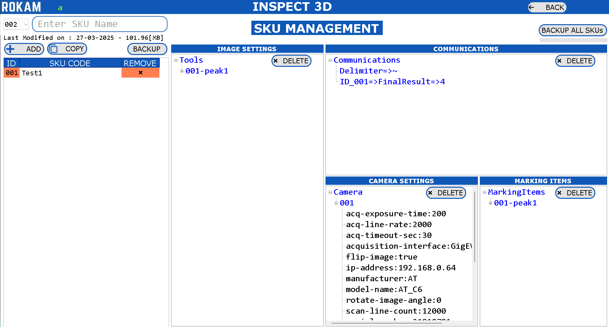
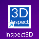
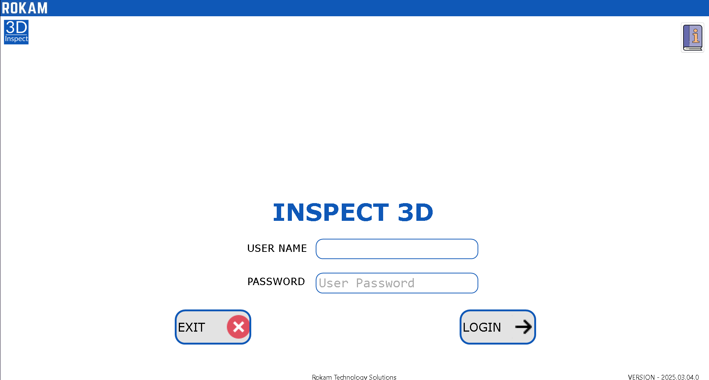
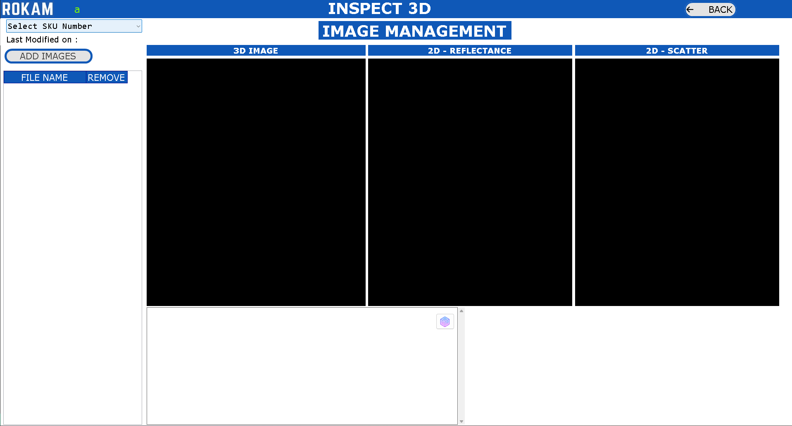
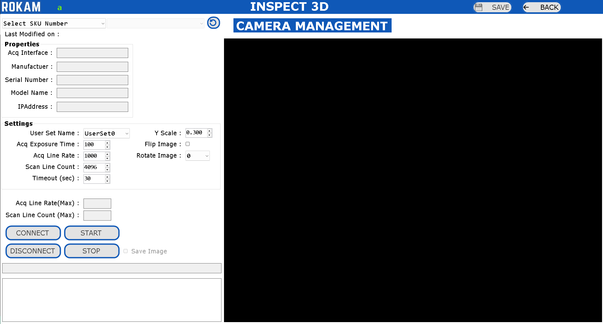

# **INSPECT 3D**

**INTRODUCTION**

Our application specialize in advanced automation technologies such as surface detect inspection, OCR/OCV (Optical Character Recognition/Optical Character Verification), and critical measurements. These technologies are integrated into our specialized application, **QualityInspection**, which is designed to enhance precision and operational efficiency in various industrial processes.

**OBJECTIVES** 
This document describes the procedure for using the Quality Inspection application. Below is an overview of its basic architecture:

 **HARDWARE :**

1.MONITOR :

    Connectivity: HDMI or DisplayPort

    Aspect Ratio: 16:9

    Resolution: 

    [Full HD (1920x1080) with 100% Display Scaling]

    or 

    [4K (3840x2160) with 200% Display Scaling]

2.DESKTOP PC :

    Processor: Intel or AMD

    Cores: Minimum 8 Cores with Minimum 16 Logical Processors

    Generations: Intel (12th Gen or Above); AMD (Ryzen5 or Above)

    Integrated Graphics: Intel UHD/XeGraphics or AMD Ryzen with Radeon Graphics

    SSD: 1TB; RAM: 16GB DDR4

    Ethernet: Intel Gigabit Ethernet Port (I219-V or Equivalent)

    USB3.0: Intel USB3.0 xHCI Compliant Host Controller Type-A

 **SOFTWARE :**

OPERATING SYSTEM :

    Windows 10 Pro or Windows 11 Pro; 64-Bit (x64)

QUALITY INSPECTION APPLICATION :

The full installation, including the operating system, will require approximately 50 GB of space on the C drive for the new PC.

## **APPLICATION**

Click on the "**QualityInspection**" application icon located on the desktop. Once the application opens, it will start automatically. The following screen will appear for a few seconds while the required settings are loaded.

## **LOGIN**

    1.Click the i icon to open the User Manual.

    2.View the application version number in the bottom-right corner of the screen.

    3.Enter your username and password on the login screen.

    4.Click the Login button to access the application.

    5.Click the Exit button to close the application.

    6.Contact the administrator for a valid username and password if needed.

    7.The logged-in username will appear in the top-left corner of every screen.

## **QUALITY INSPECTION**   DASHBOARD

The dashboard contains all options available in this application. Some options are accessible based on the user type, as explained in the User Management section. 

**Settings:** All the Settings for the Application are editable.

**User Management:** Add/Delete/View the users for this application.

**SKU Management:** Add/Delete/View the SKUs for this application.

**Marking Items:** Add/Delete/View the Marking Items for each SKU

**Camera Management:** Configure the Camera for each SKU based on the requirement

**Image Management:** Delete/View the Images which are captured as reference by the Camera Management.

**Teach Image:** Edit the Inspection Parameters for each SKU

**Communications:** Add/Delete the communication parameters required to send inspection parameters for each SKU to the other device.

**Inspection:** Inspect the Components based on the configured Settings for each SKU.

**Alarms:** View/Export the Alarms that are logged in this Application.

**Results:** View the Result (PDF, Image, Individual Results) for each inspection Components

**Reports:** View all the Results in a Single View with Statistical Analysis.

**TCPServer:** Sample Application to Test and Check if the TCP Server is working properly with the TCP Client.

**ModbusTCP:** Sample Application to Test and Check if the ModbusTCP is working properly with the TCP Client.

**Edit Image Settings:** Modify the Settings for all Inspection Parameters for PASS/FAIL in single screen.

## **SETTINGS**

**Data Location:** Click on BrowseFolder Button and Select the Folder where we need to save the Inspection Results.

**TCP Server:** Enter the Credentials of the TCP Server Settings which is used for the Communication to send the data from Application to the other TCPClient Device (PLC, PC, etc.)

**Modbus TCP:** Enter the Credentials of the ModbusTCP Settings which is used for the Communciation to send the data from Application to the other Modbus Device (PLC, PC, etc.)

*Note :* Only one Communication Protocol can be enabled, either TCPServer or ModbusTCP.

**Auto Delete Results:** Enable the Checkbox to delete the results automatically during startup of application.
If this option is enabled, then during Startup of the Application, if the Available Space in the “Results Location Drive” is Less than 25% of that respective “Full Drive Capacity”, then the Application will Delete only 1 Inspection Result on the Starting Inspection Date for all available SKUs.

**Scanner:** Enable or Disable the Barcode Scanner Functionality. This can be used to Select the SKU automatically by scanning the barcode

**Webcam:** Enable or Disable the Webcam Functionality. This can be used to view the user who is logging in the application and capture the picture of the same to application data.

**Expand Tree View:** Enable or Disable this Functionality so that we can view the results in expanded mode or condensed mode in the inspection view.

**Save Original Image:** Enable or Disable this Functionality, so that if we need to save the original image which is been captured during inspection for every component.

**Save Original Image Format:** Select one among PNG, JPG, TIFF so that the original image has to be saved with different file format, which will be helpful based on different applications.

**Display Cycle Time in [ms]:** Enable or Disable this Functionality, so that we display the Cycle Time in the Inspection view in milliseconds or in seconds.

**OCR MODEL:**

    Detection Model: Browse a new Detection Model that has to be used by this application.

    Recognition Model: Browse a new Recognition Model that has to be used by this application.

    Update Model: Update the selected Detection & Recognition Model to the application

    Save: Click on Save Button to save the Settings.

    Back: Click on Back Button to go back to Dashboard Screen.

## **USER MANAGEMENT**

You can **add new users**, **delete existing users**, and **view existing users**. To add a **new user**, enter a username (up to 8 characters), a password (up to 8 characters), and select a role: **Administrator**, **Maintenance**, or **Operator**. Then, click the **Add User** button.

**Role Accessibility:**

## **SKU MANAGEMENT**   

**Accessible for:** Administrator

   You can create, delete, copy, or view an SKU.

**SKU ID:** This ID is used as Short-Code for SKU Name to access SKU using PLC, etc.

**SKU Name:** This is used as the name of the Item that has to be inspected.

**Create:** Select the SKU ID and enter the new SKU Name and click on **ADD** button. Special Characters and Existing SKU Names are not allowed to create new SKU.

**Delete:** Select the SKU.  Click on the ‘**x**’ mark. It will prompt dialog box to accept for the deletion of the SKU. Once it is deleted, it is deleted permanently and it is not possible to recover it back.

**Copy:** Select the new SKU ID and Enter the New SKU Code. Select the Existing Job and Click on **COPY** Button. After Copy is completed, the newly copied Job is appeared in the list.

**View:** All the Settings relative for the SKU will be visible in the main screen of this SKU Management.

The Settings that are visible for every SKU are:

    •	Image Settings: The inspection parameters are displayed in this section.

    •	Communications: The values to be sent to other devices via Modbus TCP and
                        TCP Server are displayed in this section.

    •	Camera Settings: The camera settings for each SKU, such as the serial number
    ,                    IP address, etc., are displayed in this section.

    •	Marking Items: The naming conventions for the inspection parameters that have 
                       been configured are displayed in this section.

You can also delete individual settings by clicking the **DELETE** button.

## **MARKING ITEMS**

Accessible for: **Administrator**

There are various tools available in this application for component inspection. You can configure the required tools by selecting the tool name, tool ID, and marking name.

•	Select the Existing **SKU**.

•	Select the Tool and Select **Marking ID**.

•	Enter Marking Name and Click on **ADD** Button.

•	Select all inspection parameters and add tools which are required for inspection.

•	Click the **Save** button to save the inspection parameters linked to the selected SKU.

•	Click on **Back** Button to go back to Dashboard Screen.

•	Select "**PatternMatchMax**" as the first marking tool if you need to reference other inspection tools with pattern matching. This will ensure that the inspection tools move accordingly wherever the object moves

## **CAMERA MANAGEMENT** 

Accessible for: **Administrator**

You can select a camera from the list of available, configured cameras. Each camera should be selected and configured with the appropriate SKU. There are various tools available in this application for component inspection. Configure the required tools by selecting the tool name, tool ID, and marking name.

•	Select the **SKU Number**.  

•	Select the **Camera**.

•	Click on **SAVE**  button to save the Camera Settings for the Selected **SKU**.

•	Click on **BACK**  button to go back to the dashboard.

## **IMAGE MANAGEMENT**

Accessible for: **Administrator**

The images saved from **Camera Management** are displayed on this screen

•	Select the **SKU Number**. 

•   **Add Images:** You can also add images manually, though they are typically captured from Camera Management. If a camera is unavailable, offline inspection can be performed by adding images manually.

•   **Delete Images:** If the saved images from the camera are not satisfactory, you can delete the image for the selected SKU

•   Click the **BACK** button to return to the dashboard screen.

## **COMMUNICATIONS SETTINGS**  

Accessible for: **Administrator**

### **COMMUNICATIONS** 

Accessible for: **Administrator**

•	Select the SKU Number. 

•	Select the Communication String from the Tool using Drop-Down Box.

•	Click on "**+**" Button to add the String to the Communication List.

•	Select the Delimiter from the Drop-Down Box. 

•	Click on **SAVE** Button to Save the Communication String relevant to SKU.

•   Click the **BACK** button to return to the dashboard screen.

For All Inspection Tools, all the result details will be available in this communication string to configure.
The configured communication string will be separated using “delimiter” when the communication string is sent through the TCP Server.The configured communication string will be sent through the ModbusTCP to the respective modbus registers.
 

### **MODBUS TCP**

Accessible for: **Administrator** and **Maintenance**

• Select the **ModbusTCP** option, and the application will act as the Modbus TCP client, while the PLC will act as the Modbus TCP server.

• The IP address, port number, start address, and multiplication factor (for digital values) will be configured in the settings.

• The heartbeat interval for the Quality Inspection application to monitor the Modbus TCP register for read/write operations is 30 milliseconds.

Handshaking of Registers between the PLC and ModbusTCP in the Quality Inspection Application is explained below.

 
The standard Modbus registers are pre-configured with their register locations, but these locations can be reconfigured. This option is accessible only to administrators.

**COMMUNICATION:** This is used to establish a heartbeat communication between the Quality Inspection application and the PLC. Every 5 seconds, the application writes a register value of '1', and the PLC checks if the value is '1'. If the value is not '1' within the heartbeat period, the PLC will detect a communication issue. The PLC will then write a register value of '2'.

**SKUID:**  To select an SKU from the PLC, the PLC will write the SKU ID to the SKUID register location. Refer to SKU Management to find the SKUID for each SKU.

**SKUID_FEEDBACK:** The application will monitor the SKUID, and if a valid SKUID is read from the SKUID register location, the respective SKU will be loaded into the application (all camera and inspection parameters will be loaded and ready for inspection). Once the SKU is successfully loaded, the application will write the same SKUID value to the SKUID_FEEDBACK register. When the PLC reads this value, it will reset the register to '0'.

*Example :* The PLC will send the value '5' to the SKUID register. The application will then look for and load the SKU with SKUID '5'. Upon successful loading of the SKU, the value '5' will be sent back to the SKUID_FEEDBACK register location.

**TRIGGER:**  To start the inspection of an object, the PLC will write the value '1' to the TRIGGER register location.

**TRIGGER_FEEDBACK:** Once the application reads the TRIGGER register with the value '1', the TRIGGER register will be reset to '0', and the TRIGGER_FEEDBACK register will be written with '1'. The PLC will receive the TRIGGER_FEEDBACK and reset its value to '0'.

**CAMERA_STATUS:** The application will write the value to the CAMERA_STATUS register. The PLC will monitor this status and perform the process steps according to its automation cycle.

    Register Value as 3 => if the inspection is in progress.
    Register Value as 2 => ready to take the trigger
    Register Value as 0 => camera is not yet ready

**RESULT:** The application will write the value to the RESULT register. The PLC will monitor this result and perform the process steps according to its automation cycle.

    Register Value as 2 => if the Result is FAIL.
    Register Value as 1 => if the Result is PASS.
    Register Value as 0 => if the Result is Not Yet Ready.

**Location of MODBUS Registers:**

Register Location: Start Address [Refer Settings] + Register Location

To simulate Modbus TCP, you can use the Modbus Simulator application, which can be downloaded from the internet.

•	Open Modbus Server in the **PLC**.

•	Click the **CONNECT** button. If Modbus is enabled on the PLC, the Modbus TCP Client application will connect; otherwise, it will not connect.

•	Write Registers: Select the Value and Click on **ADD** Button.

•	Write Registers: Click on **WRITE MULTIPLE REGISTERS** Button.

•	Read Registers: Click on **READ MULTIPLE REGISTERS** Button.

•	The values that are written should be readable..

•	Click on **DISCONNECT** button.

•	Click the **BACK** button to return to the dashboard.

### **TCP SERVER**

Accessible for: **Administrator** and **Maintenance**

Select the **TCP Server** option, and the application will act as a TCP server, while the PLC will act as a TCP client. The following are the TCP server commands used to control the application in the inspection screen:

(1) **Reset the Job**
    Syntax: SKU_RESET
    Response: SUCCESS or FAILURE

(2) **Get the List of Jobs Available**
    Syntax: SKU_LIST
    Response: Provides a list of jobs, separated by commas.

(3) **Select the Job** – 3 Ways to Load Job
    Syntax: SKUCODE_jobName
    Example: SKUCODE_newjob1
    Response: SUCCESS or FAILURE

    Syntax: SKUID_jobID
    Example: SKUID_001
    Response: SUCCESS or FAILURE

    Syntax: SKUIDCODE _jobID-jobName
    Example: SKUIDCODE_001-newjob1
    Response: SUCCESS or FAILURE
    Action: The Application will load the respective SKU Settings to the inspection.

(4) **Trigger Image**
    Syntax: TRIGGER_filename
    Example: TRIGGER_range-image_00001
    Response: Data which is configured in Communications

(5) **Trigger Camera** 
    Syntax: TRIGGER
    Response: Data which is configured in Communications

To simulate a TCP client, you can use the **Hercules** application, which can be downloaded from the internet.

•	Click on **START SERVER** button.

•	Open the **Hercules** application and launch the **TCP Client**. Enter the IP address as '127.0.0.1' or the IP address displayed on the TCP Server screen.

•	Enter the port number configured in the TCP server into the TCP client.

•	Click on **Connect Button** in the TCP Client.

•	Send some data from the TCP client and check if it is received by the TCP server.

•	Send some data from TCP Server and check if it is received by the TCP Client.

•	If data transmission between the **TCP client** and **TCP server** is successful, we can confirm that the TCP server is working as expected.

•	Click on **STOP SERVER** button.

•	Click on **BACK** button to return to the Dashboard.

## **TEACHING PART**

Accessible for: **Administrator**

### **TEACH IMAGE** 

## **INSPECTION**

Accessible for: **Administrator**, **Maintenance** and **Operator**.

•	Select the **SKU number** manually, or wait for the PLC to automatically select it through ModbusTCP communication.

•	The settings linked to the selected SKU will be loaded into the application

•	**Administrator/Maintenance:** Will have an option to manually load the image to inspect the image.

•	**Operator:** Must wait for the PLC to trigger the camera through ModbusTCP.

•	Once the image is ready, the inspection will occur automatically and update the following:

    o   A new image with graphics will appear in the center of the screen.

    o   The inspection results for all tools will be updated in the tree view on the right side of the screen.

    o   The PASS/FAIL counter will be updated at the bottom right of the screen.

    o   The trigger number and cycle time details will be updated at the bottom right of the screen.

    o   A message to the operator about the application status will be displayed at the top center of the screen.
 
## **ALARMS**

Accessible for: **Administrator**, **Maintenance** and **Operator**.

Alarms will display all log information for the application.

•	Select Date and Select Type of Alarm 

•	Click on **GET ALARMS**  Button.

•	To export alarms, select the start date and end date, then click the Export Alarms button. The alarm data will be exported to the '**Data Location**' folder.

•	Click the  **BACK** Button to return to the Dashboard.

## **RESULTS**

Accessible for: **Administrator**, **Maintenance** and **Operator**.

•	Select the **SKU Number**.

•	Select the **Date**.

•	Click on **GET RESULTS** Button.

•	The Results will be Displayed in the List.

•	Click on the trigger number to view the result of the inspected object.

•	Click on **PDF ICON** to see the PDF report of the Inspection.

•	Expand the Tree View to View the Full Inspection details of the inspected object.

•	The graphic image will be displayed in the center of the screen.

•	The metadata information about the inspected object is available at the bottom left corner of the screen.

•	Click the **BACK** Button to return to the Dashboard.

## **REPORTS**

Accessible for: **Administrator**, **Maintenance** and **Operator**.

•	Select the **SKU Number**.  

•	Select the **Start Date** and **End Date**. 

•	Select the **User Name**

•	Select the Result **PASS/FAIL/ALL**.

•	Click on **GET REPORTS** Button.

•	The total, pass, and fail counts will be displayed in a table and also shown in a pie chart.

•	The Failed Details will be shown in Table.

•	The results of all inspection details will be updated in the list.

•	Click the **EXPORT** button to export the list of all inspection details to a CSV file in the Data Location folder.

•	Click on the **Trigger number** to view the result of the inspected object.

•	Click on the **PDF icon** to view the PDF report of the inspection.

•	Click on **BACK**  Button to return to the Dashboard.

•	Select the trigger details to view the history of all inspection results in graph form.

## **EDIT IMAGE SETTINGS**

Accessible for: **Administrator** and **Maintenance**

•	Select the **SKU Number**.  

•	Click on **LOAD SETTINGS** Button.

•	Click to edit the “MIN VALUE NEW” and “MAX VALUE NEW” for each inspection tool name.These Values will decide for PASS or FAIL for the Inspection Result for individual tool.

•	View the “MIN VALUE OLD” and “MAX VALUE OLD” to view existing settings value.

•	Click on **SAVE**  button to save the Image Settings.

•	Click on **BACK** button to return to the Dashboard.

..................x.................................x.................................x...............................x................................x..................................x.............................x..........................x

## **MAINTENANCE and TROUBLESHOOTING**

***Maintenance :***

•	The inspection results are stored in the 'Data Location' folder. Please ensure that at least 25% of free space is always available on the respective drive.

•	If less than 5% of free space is available on the application installation drive (ideally the C drive) or on the 'Data Location' folder drive, the application will not open.

 ***TROUBLESHOOTING :***

•	There are three types of messages that will appear in a dialog box.

•	Information, Warning and Error

•	When an error occurs, delete the SKU with the error through SKU Management and create a new SKU for it.

•	Please read the camera user manual carefully for troubleshooting instructions.