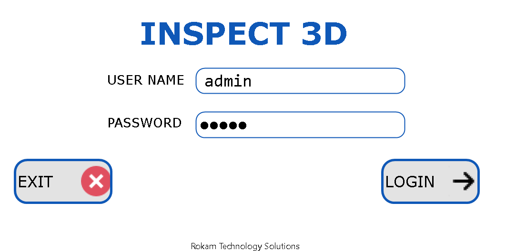
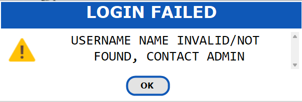
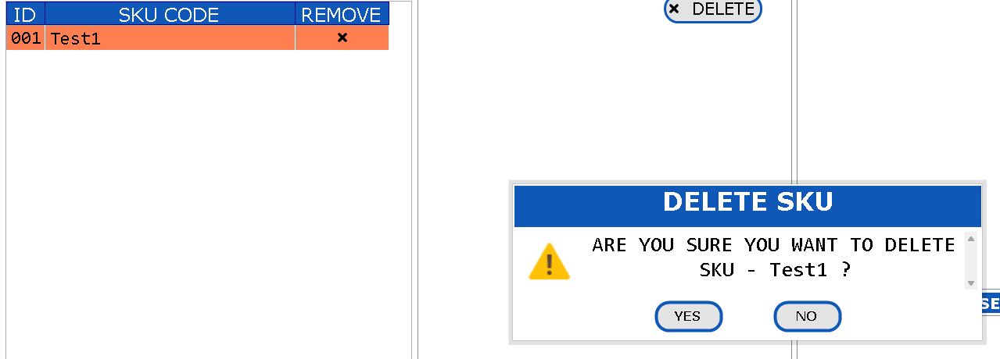
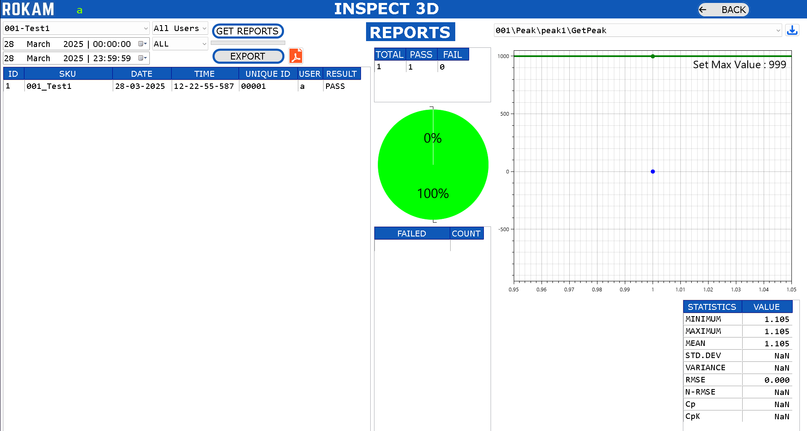
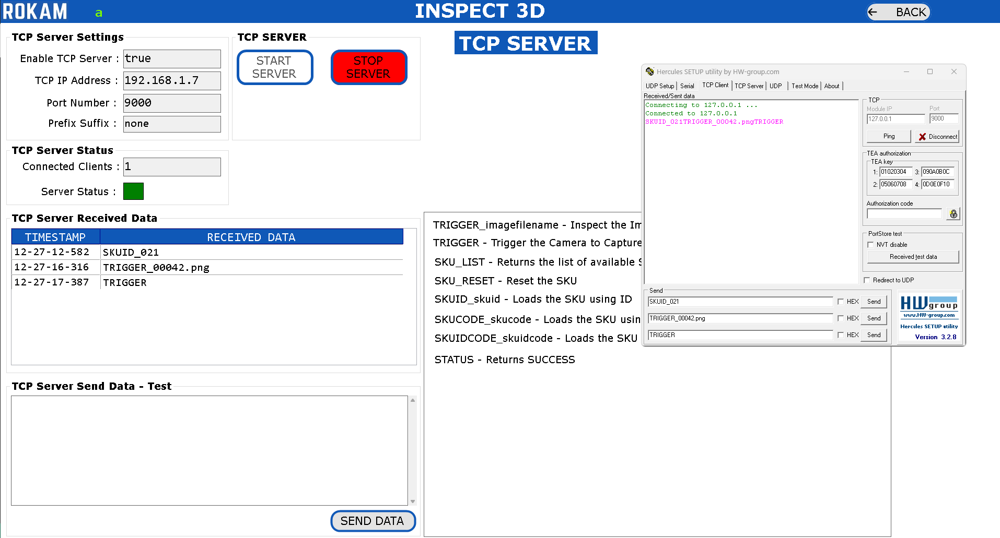

# **INSPECT 3D**

**INTRODUCTION**

Our application specialize in advanced automation technologies such as surface detect inspection, OCR/OCV (Optical Character Recognition/Optical Character Verification), and critical measurements.These technologies are integrated into our specialized application, **Inspect3D**, which is designed to enhance precision and operational efficiency in various industrial processes.

##**1. OBJECTIVES**

This document describes the procedure on the usage for the Tyre Side Wall Stamping Inspection Application.

The 3D Camera is mounted to the Robot 6th Axis and Scan the Sidewall of the Tyre to capture the 3D Data of the Sidewall of the Tyre.

The 3D Data will be Inspected and the Application will shows the Results.

 

**HARDWARE :**

1. MONITOR :

        Connectivity: HDMI or DisplayPort

        Aspect Ratio: 16:9

        Resolution: 

        [Full HD (1920x1080) with 100% Display Scaling]   or
 

        [4K (3840x2160) with 200% Display Scaling]

2. DESKTOP PC :

        Processor: Intel or AMD

        Cores: Minimum 8 Cores with Minimum 16 Logical Processors

        Generations: Intel (12th Gen or Above); AMD (Ryzen5 or Above)

        Integrated Graphics: Intel UHD/XeGraphics or AMD Ryzen with Radeon Graphics

        SSD: 1TB; RAM: 16GB DDR4

        Ethernet: Intel Gigabit Ethernet Port (I219-V or Equivalent)

        USB3.0: Intel USB3.0 xHCI Compliant Host Controller Type-A

 **SOFTWARE:**

OPERATING SYSTEM :

        Windows 10 Pro or Windows 11 Pro; 64-Bit (x64)

QUALITY INSPECTION APPLICATION :

 

The full installation, including the operating system, will require approximately 50 GB of space on the C drive for the new PC.

##**2. SOFTWARE APPLICATION**

Open the Application which is located in Desktop.

 

Once the Application is opened, then Application will start. The Below Screen will appear for few seconds which will load all the settings required for the application.

 

If there are any warnings or error, the respective dialog box will be shown. 
After this screen is completed, the Login Screen will open.

##**2.1 LOGIN**

 

    1.Click the i icon to open the User Manual.

    2.View the application version number in the bottom-right corner of the screen.

**Enter your username and password on the login screen.**

 

    1.Click the Login button to access the application.

    2.Click the Exit button to close the application.

    3.The logged-in username will appear in the top-left corner of every screen from Dasboard.

**Contact the administrator for a valid username and password if needed.** 

 

##**2.2 DASHBOARD**

 

The dashboard contains all options available in this application. Some options are accessible based on the user type, as explained in the User Management section. 

**Settings:** All the Settings for the Application are editable.

**User Management:** Add/Delete/View the users for this application.

**SKU Management:** Add/Delete/View the SKUs for this application.

**Marking Items:** Add/Delete/View the Marking Items for each SKU

**Camera Management:** Configure the Camera for each SKU based on the requirement

**Image Management:** Delete/View the Images which are captured as reference by the Camera Management.

**Teach Image:** Edit the Inspection Parameters for each SKU

**Communications:** Add/Delete the communication parameters required to send inspection parameters for each SKU to the other device.

**Inspection:** Inspect the Components based on the configured Settings for each SKU.

**Alarms:** View/Export the Alarms that are logged in this Application.

**Results:** View the Result (PDF, Image, Individual Results) for each inspection Components

**Reports:** View all the Results in a Single View with Statistical Analysis.

**TCPServer:** Sample Application to Test and Check if the TCP Server is working properly with the TCP Client.

**ModbusTCP    :** Sample Application to Test and Check if the ModbusTCP is working properly with the TCP Client.

**Edit Image Settings:** Modify the Settings for all Inspection Parameters for PASS/FAIL in single screen.

**camera diagnostics:** This option is used to check the outputs or inputs given to the camera.

**Image diagnotics:** to view the point cloud file of the scanned component.

##**2.3 SETTINGS**

 

**Data Location:** Click on BrowseFolder Button and Select the Folder where we need to save the Inspection Results.

**TCP Server:** Enter the Credentials of the TCP Server Settings which is used for the Communication to send the data from Application to the other TCPClient Device (PLC, PC, etc.)

**Modbus TCP:** Enter the Credentials of the ModbusTCP Settings which is used for the Communciation to send the data from Application to the other Modbus Device (PLC, PC, etc.)

*Note :* Only one Communication Protocol can be enabled, either TCPServer or ModbusTCP.

**Auto Delete Results:** Enable the Checkbox to delete the results automatically during startup of application.
If this option is enabled, then during Startup of the Application, if the Available Space in the “Results Location Drive” is Less than 25% of that respective “Full Drive Capacity”, then the Application will Delete only 1 Inspection Result on the Starting Inspection Date for all available SKUs.

**Scanner:** Enable or Disable the Barcode Scanner Functionality. This can be used to Select the SKU automatically by scanning the barcode

**Webcam:** Enable or Disable the Webcam Functionality. This can be used to view the user who is logging in the application and capture the picture of the same to application data.

**Expand Tree View:** Enable or Disable this Functionality so that we can view the results in expanded mode or condensed mode in the inspection view.

**Save Original Image:** Enable or Disable this Functionality, so that if we need to save the original image which is been captured during inspection for every component.

**Save Original Image Format:** Select one among PNG, JPG, TIFF so that the original image has to be saved with different file format, which will be helpful based on different applications.

 

**Display Cycle Time in [ms]:** Enable or Disable this Functionality, so that we display the Cycle Time in the Inspection view in milliseconds or in seconds.

**OCR MODEL:**

    Detection Model: Browse a new Detection Model that has to be used by this application.

    Recognition Model: Browse a new Recognition Model that has to be used by this application.

    Update Model: Update the selected Detection & Recognition Model to the application

    Save: Click on Save Button to save the Settings.

    Back: Click on Back Button to go back to Dashboard Screen.

##**2.4 USER management**

 

You can **add new users**, **delete existing users**, and **view existing users**.

To add a **new user**, enter a username (up to 8 characters), a password (up to 8 characters), and select a role: **Administrator**, **Maintenance**, or **Operator**. 

Then, click the **Add User** button.

**Role Accessibility:**

 

##**2.5 SKU MANAGEMENT**

 

**Accessible for:** Administrator

   You can create, delete, copy, or view an SKU.

**SKU ID:** This ID is used as Short-Code for SKU Name to access SKU using PLC, etc.

**SKU Name:** This is used as the name of the Item that has to be inspected.

**Create:** Select the SKU ID and enter the new SKU Name and click on **ADD** button. Special Characters and Existing SKU Names are not allowed to create new SKU.

 

**Delete:** Select the SKU.  Click on the ‘**x**’ mark. It will prompt dialog box to accept for the deletion of the SKU. Once it is deleted, it is deleted permanently and it is not possible to recover it back.

 

**Copy:** Select the new SKU ID and Enter the New SKU Code. Select the Existing Job and Click on **COPY** Button. After Copy is completed, the newly copied Job is appeared in the list.

 

**View:** All the Settings relative for the SKU will be visible in the main screen of this SKU Management.

 

The Settings that are visible for every SKU are:

    •	Image Settings : The inspection parameters are displayed in this section.

    •	Camera Settings : The camera settings for each SKU, such as the serial number
    ,IP address, etc., are displayed in this section.

    •	Marking Items : The naming conventions for the inspection parameters that have 
    been configured are displayed in this section.

    •	Communication Settings : The communication strings that are added to the sku will be visible in this section

You can also delete individual settings by clicking the **DELETE** button.

##**2.6 MARKING ITEMS**

There are various tools available in this application for component inspection. You can configure the required tools by selecting the tool name, tool ID, and marking name.

 

 

•	Select the Existing **SKU**.

•	Click on **Select Tool** and Select **Marking ID** which is the tool required for the inspection.

•	Enter Marking Name and Click on **ADD** Button.

•	Select all inspection parameters and add tools which are required for inspection.

•	Click the **Save** button to save the inspection parameters linked to the selected SKU.

•	Click on **Back** Button to go back to Dashboard Screen.

•	Select "**PatternMatchMax**" as the first marking tool if you need to reference other inspection tools with pattern matching. This will ensure that the inspection tools move accordingly wherever the object moves

##**2.7 CAMERA MANAGEMENT**

You can select a camera from the list of available, configured cameras. Each camera should be selected and configured with the appropriate SKU. There are various tools available in this application for component inspection. Configure the required tools by selecting the tool name, tool ID, and marking name.

 

•	Select the **SKU Number**.  

•	Select the **Camera**.

•	Enable the Save Image Option.

•	Click on **CONNECT**** Button.

•	Click on **START** Button.

•	Send the **TRIGGER** Command through ModbusTCP from PLC.

•	Once the Image is captured, the STOP Button will be clicked automatically.

•	Click on **SAVE**  button to save the Camera Settings for the Selected **SKU**.

•	Click on **BACK**  button to go back to the dashboard.

##**2.8 IMAGE MANAGEMENT**

Accessible for: **Administrator**.

 

The images saved from **Camera Management** are displayed on this screen

•	Select the **SKU Number**.

•   **Add Images:** You can also add images manually, though they are typically captured from Camera Management. If a camera is unavailable, offline inspection can be performed by adding images manually.

•   **Delete Images:** If the saved images from the camera are not satisfactory, you can delete the image for the selected SKU

•   Click on 3D Button(cube) below the images to view the image in 3D Viewer.

•   Click the **BACK** button to return to the dashboard screen.

##**2.9 TEACH IMAGE**

Accessible for: Administrator

•   Select SKU and click on **Load Settings** Button.

•   Select Image Number.

•   Select Marking Item.  

•   Click on **ADD** Button to Add/Edit Inspection Parameters

Select any Marking Item and click on **ADD** Button.

 

If the Marking Item is already available in the list, then it is possible to Delete the Marking Item by clicking on ‘**x**’ for selected Marking Item, or Edit the Marking Item by selecting the Marking Item from list and click on **EDIT** Button.

Click on **SAVE** button to save the settings for the Selected SKU.

Click on **BACK**  button to go back to the dashboard.

When Clicked on ADD/EDIT button, the new screen will open to configure the inspection settings for that respective Marking Item configured Tool Name.

Just for example, for each tool, a new marking item has been added in this user manual. Below is the Description for each Inspection Tool.

**Tools:**

**Pattern Match Max:** This tool is used to identify the pattern which is trained on the image. Used in Locating the Object, Presence/Absence of Objects in Image

**Surface Distance:** This tool is used to measure distance from one surface to another surface for the defined regions.

**Peak:** This tool is used to measure the distance value for the defined region.

**Blob:** This tool is used to count the objects which are available at different surface distances.

**Width:** This tool is used to measure the width between two edges for the defined region

**Pixel Counter:** This tool is used to calculate the number of pixel values available in the given grey scale min-max values. Used for Presence/Absence of Objects in Image.

**Combine Results:** This tool is used to give the combined results of all the configured tools.

After configuring all tools, the teach image screen will look like this:

 

###**2.9.1 PATTERN MATCH MAX**

 

**Search Region:** It is Yellow-Color Region where the pattern has to be searched.

**Pattern Region:** It is Blue-Color Region where the pattern has to be trained.
If the Tool is Added for the First Time, then follow the below procedure:

•	Click on **SELECT REGION** Button. Modify the Region of Pattern Region to train the pattern and modify the Region of Search Region in-order to search the Pattern.

•	Click on **TRAIN** Button to train the selected Pattern Region.

•	Click on **RUN** Button to run the Pattern in the Search Region.

•	View the Pattern Found Results.

•	Click on **SAVE** Button to save the setting.

•	Click on **BACK** Button to go back to Dashboard

If the Tool is Already Added and Clicked on Edit Button, then follow the below procedure:

•	Modify the Search Region (if required).

•	Click on **RUN** Button to run the Pattern in the Search Region.

•	View the Pattern Found Results.

•	Click on **BACK** Button to go back to Dashboard.

Additionally, there are many settings for the “PatternMatchMax” Tool.

**Result:** The Result will be PASS or FAIL based on conditions, i.e., Pattern Count Min and Max. The Results contains the details such as Center-X, Center-Y, Angle, Score of the pattern.

The Settings depends on type of application on how pattern has to be trained and searched in the image.

###**2.9.2 SURFACE DISTANCE**

 

•	Click on **SELECT REGION**  Button. Modify the Regions.

•	Edit the Min and Max Values for the “Distance Final Value” Decision.

•	Click on **RUN** Button to get the Results. 

•	View the Results – the Distance in mm between Two Regions.

•	Click on **BACK**  Button to go back to Dashboard.

**Fixtured Tool:** Select ‘ImageSource’ or ’01-reference’ based on requirements.

**ImageSource :**Load actual image which is captured from camera.

**01-reference :** Load referenced image which is routed through pattern match max tool. If the Object is moved, then this tool also will move accordingly(x, y, angle).

**Select A Region:** Select the Region as RECT_ROTATED or ELLIPSE. 

**Select Region Button:** Click on this button to add the new Regions on the image and modify the regions where we need to measure the distance.

**Reference Type:** Select ‘AVERAGE’ or ‘HIGHEST’ or ‘LOWEST’ based on type of measurement which is relevant for Green-Color Region.

**Region Type:** Select ‘AVERAGE’ or ‘HIGHEST’ or ‘LOWEST’ based on type of measurement which is relevant for Blue-Color Region where we need to calculate the distance w.r.t reference.

**Offset:** Enable offset and enter the Min and Max Offset Values – if it is enabled, then the measurement will be measured in between the offset values (mm) only.

**Result:** The Result is PASS or FAIL based on conditions, i.e., Distance Final Value Min and Max. The Results contains details such as Distance in mm between selected two regions.

The Settings depends on type of application on how measurement has to be done between two regions.

###**2.9.3 PEAK**

 

•	Click on **SELECT REGION**  Button. Modify the Regions.

•	Edit the Min and Max Values for the “Peak Final Value” Decision.

•	Click on **RUN** Button to get the Results.

•	View the Results – the Distance in mm at the selected region.

•	Click on **BACK** Button to go back to Dashboard.

**Fixtured Tool:** Select ‘ImageSource’ or ’01-reference’ based on requirements.

*ImageSource :* Load actual image which is captured from camera.

*01-reference :* Load referenced image which is routed through pattern match max tool. If the Object is moved, then this tool also will move accordingly(x, y, angle).

**Measurement Type:** Select ‘AVERAGE’ or ‘HIGHEST’ or ‘LOWEST’ based on type of measurement.

**Select A Region:** Select the Region as RECT_ROTATED or ELLIPSE.

**Select Region Button:** Click on this button to add the new Region on the image and modify the region where we need to measure the peak value.

**Result:** The Result will be PASS or FAIL based on conditions, i.e., Peak Final Value Min and Max. The Results contains the details such as Peak in mm.

The Settings depends on type of application on the peak value has to be measured.

###**2.9.4 BLOB**

 

•	Click on **SELECT REGIONS** Button. Modify the Regions.

•	Enter the Distance Min and Max Values.

•	Enter the Blob Count Min and Max Values.

•	Click on **RUN** Button to get the Results. 

•	View the Results – (Center-X, Center-Y in mm) and Blob Area at the selected region.

•	Click on **BACK** Button to go back to Dashboard.

**Fixtured Tool:** Select ‘ImageSource’ or ’01-reference’ based on requirements.

*ImageSource :* Load actual image which is captured from camera.

*01-reference :* Load referenced image which is routed through pattern match max tool. If the Object is moved, then this tool also will move accordingly(x, y, angle).

**Select A Region:** Select the Region as RECT_ROTATED or ELLIPSE.

**Select Region Button:** Click on this button to add the new Region on the image and modify the region where we need to measure the peak value.

The Yellow-Color Region is used to calculate the peak value at the selected region. The Blue-Color Region is used to find the blob with the settings.

**Distance (mm):** Enter the Min Max distance in mm where the blob has to be identified.

**Blob Area (px):** Enter the Min Max blob area in pixels where the blob has to be identified.

**Circularity, Num Holes:** Enter the Min Max of blob circularity and number of holes where the blob has to be filtered.

**Result:** The Results contains the details such as Blob Center-X, Center-Y in mm and Blob Area.

The Settings depends on type of application on how blob tool has to be calculated.

###**2.9.5 WIDTH**

 

•	Click on **SELECT REGION** Button. Modify the Regions.

•	Enter the Width Min and Max Values.

•	Click on **RUN** Button to get the Results. 

•	View the Results – Width in mm.

•	Click on **BACK** Button to go back to Dashboard.

**Fixtured Tool:** Select ‘ImageSource’ or ’01-reference’ based on requirements.

*ImageSource :* Load actual image which is captured from camera.

*01-reference :* Load referenced image which is routed through pattern match max tool. If the Object is moved, then this tool also will move accordingly(x, y, angle).

**Measurement Type:** Select ‘AVERAGE’ or ‘HIGHEST’ or ‘LOWEST’ based on type of measurement.

**Select A Region:** Select the Region as RECT_ROTATED.

**Select Region Button:** Click on this button to add the new Region on the image and modify the region where we need to measure the width.

The Green-Color Region and Blue-Color Region used to calculate the width between two regions.

**Distance (mm):** Enter the Min Max distance in mm where the width has to be identified.

**Polarity, Priority, Num Points:** Select the values for the Edge1 and Edge2, where the edge location has to be identified.

**Result:** The Result will be PASS or FAIL based on conditions, i.e., Width Min and Max. The Results contains the details such as Width in mm.

The Settings depends on type of application on how width tool has to be calculated.

###**2.9.6 PIXEL COUNTER**

 

•	Click on **SELECT REGION** Button. Modify the Regions.

•	Enter the Set Thresh Min and Max Values.

•	Click on **RUN** Button to get the Results. 

•	View the Results – Pixel Counter Value.

•	Click on **BACK** Button to go back to Dashboard.

**Fixtured Tool:** Select ‘ImageSource’ or ’01-reference’ based on requirements.

*ImageSource :* Load actual image which is captured from camera.

*01-reference :* Load referenced image which is routed through pattern match max tool. If the Object is moved, then this tool also will move accordingly(x, y, angle).

**Select A Region:** Select the Region as RECT_ROTATED or ELLIPSE.

**Select Region Button:** Click on this button to add the new Region on the image and modify the region where we need to measure the summation of pixel gray values count in region.

**Set Thresh:** Enter the Min Max gray scale values in where the pixel counter values has to be taken into consideration for calculating pixel counter.

**Set Filter, Set Polarity, Set Area, Circularity, Compactness:** Select the Min and Max Values where the region has to be filtered.

**Result:** The Result will be PASS or FAIL based on conditions, i.e., PixelCounter Value Min and Max. The Results contains the details such as Summation of all Pixel Gray Scale values which are in the range of Thresh Min and Max.

The Settings depends on type of application on how width tool has to be calculated.

###**2.9.7 COMBINE RESULTS**

 

•	Select the Tool from the List.

•	Click on (**+**) Button to add the Tool to List.

•	Click on **RUN** Button to get the Results.

•	View the Results – PASS or FAIL.

•	Click on **BACK** Button to go back to Dashboard.

**Select A Tool:** Add/Delete the Configured Tools for Inspection which has to give combined results.

**Result:** The Result will be PASS or FAIL based on conditions, i.e., if any one of the tool is failed, then the final result will be FAIL or the final result will be PASS.

The Settings depends on type of application on how width tool has to be calculated.

##**2.10 COMMUNICATIONS**

Accessible for: **Administrator**.

 

•	Select the SKU Number.

•	Select the Communication String from the Tool using Drop-Down Box.

•	Click on (**+**) Button to add the String to the Communication List.

•	Select the Delimiter from the Drop-Down Box.

•	Click on **SAVE** Button to Save the Communication String relevant to SKU.

•	Click on **BACK** Button to go back to Dashboard.

For All Inspection Tools, all the result details will be available in this communication string to configure.

The configured communication string will be separated using “delimiter” when the communication string is sent through the TCP Server.

The configured communication string will be sent through the ModbusTCP to the respective modbus registers.

##**2.11 INSPECTION**

Accessible for: **Administrator**, **Maintenance** and **Operator**.

 

1. Select the SKU number manually or wait for the PLC to automatically select the SKU Number through ModbusTCP Communication.

2. The Settings which are linked with the respective SKU will be loaded to the Application.

3. Administrator/Maintenance: Will have an option to manually load the image to inspect the image.

4. Operator: Will have to wait for the PLC trigger to the camera through ModbusTCP.

5. Once the Image is ready the inspection will happen automatically and update the following:

    1. New Image with graphics will be updated to the Center of the Screen.

    2. The Inspection Results for all Tools are updated to Tree view on the Right side of the Screen.

    3. The Counter will be updated with the PASS/FAIL Counter at the Bottom Right of the Screen.

    4. The Details will be updated with the Trigger Number and Cycle Time at the Bottom Right of the Screen.

    5. The Message to the Operator on the status of the application is updated in the Top Center of the Screen.

##**2.12 ALARMS**

Accessible for: **Administrator**, **Maintenance** and **Operator**.

 

Alarms will display all log information for the application.

•	Select Date and Select Type of Alarm 

•	Click on **GET ALARMS**  Button.

•	To export alarms, select the start date and end date, then click the Export Alarms button. The alarm data will be exported to the '**Data Location**' folder.

•	Click the  **BACK** Button to return to the Dashboard.

##**2.13 RESULTS**

Accessible for: **Administrator**, **Maintenance** and **Operator**.

 

•	Select the **SKU Number**.

•	Select the **Date**.

•	Click on **GET RESULTS** Button.

•	The Results will be Displayed in the List.

•	Click on the trigger number to view the result of the inspected object.

•	Click on **PDF ICON** to see the PDF report of the Inspection.

•	Expand the Tree View to View the Full Inspection details of the inspected object.

•	The graphic image will be displayed in the center of the screen.

•	The metadata information about the inspected object is available at the bottom left corner of the screen.

 The Result will be PASS or FAIL based on conditions, i.e., Blob Count Min and Max. 
•	Click the **BACK** Button to return to the Dashboard.

##**2.14 REPORTS**

 

Accessible for: **Administrator**, **Maintenance** and **Operator**.

•	Select the **SKU Number**.  

•	Select the **Start Date** and **End Date**. 

•	Select the **User Name**

•	Select the Result **PASS/FAIL/ALL**.

•	Click on **GET REPORTS** Button.

•	The total, pass, and fail counts will be displayed in a table and also shown in a pie chart.

•	The Failed Details will be shown in Table.

•	The results of all inspection details will be updated in the list.

•	Click the **EXPORT** button to export the list of all inspection details to a CSV file in the Data Location folder.

•	Click on the **Trigger number** to view the result of the inspected object.

•	Click on the **PDF icon** to view the PDF report of the inspection.

•	Click on **BACK**  Button to return to the Dashboard.

•	Select the trigger details to view the history of all inspection results in graph form.

##**2.15 TCP SERVER**

Accessible for: **Administrator** and *Maintenance*

When we select TCP Server Option, then Application will act as TCP Server and the PLC should act as TCP Client.

Following are TCP Server Commands used to control application in Inspection Screen:

(1) **Reset the Job**

    Syntax: SKU_RESET
    Response: SUCCESS or FAILURE

(2) **Get the List of Jobs Available**

    Syntax: SKU_LIST
    Response: Provides the List of Jobs with comma separated

(3) **Select the Job – 3 Ways to Load Job**

    Syntax: SKUCODE_jobName
    Example: SKUCODE_newjob1
    Response: SUCCESS or FAILURE

    Syntax: SKUID_jobID
    Example: SKU_001
    Response: SUCCESS or FAILURE

    Syntax: SKUIDCODE _jobID-jobName
    Example: SKU_001-newjob1
    Response: SUCCESS or FAILURE
    Action: The Application will load the respective SKU Settings to the inspection.

(4) **Trigger Image**

    Syntax: TRIGGER_filename
    Example: TRIGGER_range-image_00001
    Response: Data which is configured in Communications

(5) **Trigger Camera**

    Syntax: TRIGGER
    Response: Data which is configured in Communications
    
To simulate TCP Client, we use Hercules Application which can be downloaded from internet.

 

•	Click on START SERVER button.

•	Open Hercules Application and Open TCP Client. Enter the IP Address as “127.0.0.1” or the IP Address which is visible in the TCP Server Screen.

•	Enter Port Number which is configured in the TCP Server in the TCP Client.

•	Click on Connect Button in the TCP Client.

•	Send some data from TCP Client and check if the data is received in TCP Server.

•	Send some data from TCP Server and check if the data is received in TCP Client.

•	If the Data sending and receiving is occurring fine between TCP Client and TCP Server, then we can confirm that the TCP Server is working fine as expected.

•	Click on STOP SERVER button.

•	Click on **BACK** button to go back to Dashboard.

##**2.17 MODBUS TCP**

Accessible for: **Administrator** and **Maintenance**

When we select ModbusTCP Option, then Application will act as Modbus TCP Client and the PLC should act as Modbus TCP Server.

IP Address, Port Number, Start Address, and Multiplication Factor (for digital values): Will be configured in the Settings.

Heart-beat for the Inspect3D Application to monitor ModbusTCP Register to write/read is 30 milliseconds.

Handshaking of Registers between the PLC and ModbusTCP in the Inspect3D Application is explained below.

 

The Standard Modbus Registers are pre-configured with the Register Locations. It is possible to reconfigure the Register Locations. This is accessible only for Administrator.

**COMMUNICATION :** It is used to establish a hear-beat kind of communication between the Inspect3D Application and the PLC. For every 5 Seconds, the Application will write the register value as ‘1’ and the PLC will check if the value is ‘1’ or not. If the value is not ‘1’ within the heart-beat time, then PLC can know that there is some problem with communication. PLC also will write the register value as ‘2’.

**SKUID:**  When we need to select an SKU from the PLC, then PLC will write to SKUID Register location with a number (SKUID). Please refer SKU Management to get to know the SKUID of each SKU.

**SKUID_FEEDBACK:** The Application will monitor the SKUID and if the Valid SKUID is read in the SKUID Register location, then the respective SKU will be loaded to the application (all the camera and inspection parameters are loaded and ready to inspect). Once the SKU is successfully loaded, then the SKUID_FEEDBACK register will be written with the same ‘SKUID Value’ by the Application. Once the PLC will read the same value in the register, then PLC will reset this register to ‘0’.

*Example :* PLC will send the value as ‘5’ to the SKUID register, then Application will look for the load the SKUID which is ‘5’. Upon successful loading of SKU, then Value ‘5’ will be sent back to the SKUID_FEEDBACK Register Location.

**TRIGGER:**  When we need to start the inspection for an object, then PLC will write to TRIGGER Register location with a number ‘1’.

**TRIGGER_FEEDBACK:** Once the Application read this register TRIGGER with value ‘1’, then the TRIGGER Register will be reset with number ‘0’ and TRIGGER_FEEDBACK will be written as ‘1’. The PLC will receive the TRIGGER_FEEDBACK and reset the Value with ‘0’.

**CAMERA_STATUS:** The CAMERA_STATUS Register value will be written by the Application. The PLC will monitor this camera status and perform the process steps as per their automation cycle.

    Register Value as 3 => if the inspection is in progress.
    Register Value as 2 => ready to take the trigger
    Register Value as 0 => camera is not yet ready

**RESULT:** The RESULT Register value will be written by the Application. The PLC will monitor this result and perform the process steps as per their automation cycle.

    Register Value as 2 => if the Result is FAIL.
    Register Value as 1 => if the Result is PASS.
    Register Value as 0 => if the Result is Not Yet Ready.

**Location of MODBUS Registers: **

Register Location: Start Address [Refer Settings] + Register Location

| **REGISTER NAME**    | **REGISTER LOCATION**                |
|-----------------------|-------------------------------------|
| COMMUNICATION         | 0 (configurable between 0-19)       |
| SKUID                 | 1 (configurable between 0-19)       |
| SKUID_FEEDBACK        | 2 (configurable between 0-19)       |
| TRIGGER               | 3 (configurable between 0-19)       |
| TRIGGER_FEEDBACK      | 4 (configurable between 0-19)       |
| CAMERA_STATUS         | 10 (configurable between 0-19)      |
| RESULT                | 11 (configurable between 0-19)      |

| **CUSTOM-REGISTER NAME**           | **REGISTER LOCATION**       |
|------------------------------------|-----------------------------|
| String1 Configured in Communication |    20                      |
| String2 Configured in Communication |    21                      |
| String3 Configured in Communication |    22                      |
| String4 Configured in Communication |    23                      |
| String5 Configured in Communication |    24                      |
| String6 Configured in Communication |    25                      |

To simulate Modbus TCP, we use Modbus Simulator Application which can be downloaded from internet.

 

•	Open Modbus Server in the PLC.

•	Click on CONNECT button. If the Modbus in the PLC is opened, then the Modbus TCP Client Application will Connect otherwise it will NOT Connect.

•	Write Registers: Select the Value and Click on ADD Button.

•	Write Registers: Click on WRITE MULTIPLE REGISTERS Button.

•	Read Registers: Click on READ MULTIPLE REGISTERS Button.

•	The Values which are written should be able to read.

•	Click on DISCONNECT button.

•	Click on **BACK** button to go back to Dashboard.

**For more details click on the below :**

[ModbusTCP Online Manual](https://rokamtechnology.github.io/modbusTCP_Manual/)

##**2.17 EDIT IMAGE SETTINGS**

Accessible for: **Administrator** and **Maintenance**

 

•	Select the SKU Number.

•	Click on **LOAD SETTINGS** Button.

•	Click to edit the “MIN VALUE NEW” and “MAX VALUE NEW” for each inspection tool name.
These Values will decide for PASS or FAIL for the Inspection Result for individual tool.

•	View the “MIN VALUE OLD” and “MAX VALUE OLD” to view existing settings value.

•	Click on **SAVE** button to save the Image Settings.

•	Click on **BACK** button to go back to Dashboard.

##**3.MAINTENANCE and TROUBLESHOOTING**

***Maintenance :***

•	The inspection results are stored in the 'Data Location' folder.

 Please ensure that at least 25% of free space is always available on the respective drive.

•	If less than 5% of free space is available on the application installation drive (ideally the C drive) or on the 'Data Location' folder drive, the application will not open.

 ***TROUBLESHOOTING :***

•	There are three types of messages that will appear in a dialog box.

•	Information, Warning and Error

•	When an error occurs, delete the SKU with the error through SKU Management and create a new SKU for it.

•	Please read the camera user manual carefully for troubleshooting instructions.